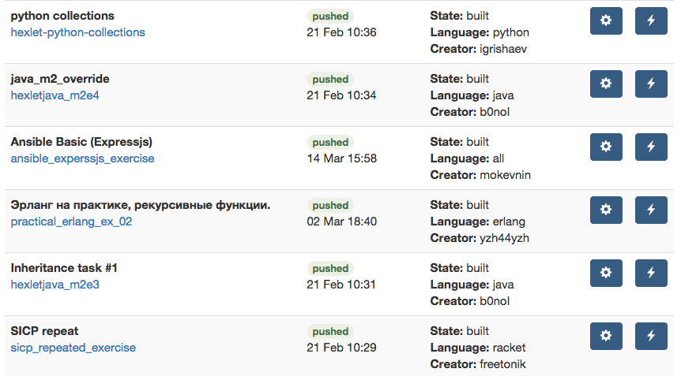

# How to create lesson and exercise

## Create a lesson

Creating a lesson is easy – just go to *[My Lessons](http://hexlet.io/account/lessons)* page and click on *[Add new lesson](http://hexlet.io/account/lessons/new)* button. There you can add theory, transcription for the video (optional), quiz questions and select an exercise. If it is your first lesson, then most probably you have no exercises to select yet. The next section explains how to create you first exercise.

Read more about [Conceptual specifications for lessons](http://feedback.hexlet.io/knowledgebase/articles/489631) and [Technical specifications for lessons.](http://feedback.hexlet.io/knowledgebase/articles/489636)

## Create an exercise

Exercise includes:

* Description of the task (what is the challenge for the student, what needs to be done in order to complete the exercise)
* Definition of the development environment (e.g. what programming languages, frameworks, servers are required to complete the exercise)
* Tests (to automatically assess student's solution)
* Solution (will not be shown to students)

In order to include an exercise to a lesson follow these steps:

1. Install Hexlet Vagrant
2. Create an exercise locally
3. Test your exercise
4. Push it to Bitbucket (private repository)
5. Login to Hexlet via Bitbucket
6. Go to *[My Exercises](http://hexlet.io/account/exercises)*, add new exercise repository url and click "Build". Hexlet builds a Docker container with the environment you have defined. When it is built, you can include this exercise into any lesson.

Let's go over each step in more detail.

### 1. Install Hexlet Vagrant

You can create and test lessons on your computer without Hexlet Vagrant, all you need is [Docker](http://docker.io) installed. But it is easier to have this small virtual machine with pre-defined environment that is guaranteed to work. No need to configure and maintain it, install once and upgrade when needed.

#### 1.1 Install VirtualBox, Vagrant and Git

VirtualBox is a free virtual machine from Oracle. Download and install a version for your operating system. Please, refer to the [official documentation](https://www.virtualbox.org/wiki/End-user_documentation) if needed.

[Vagrant](https://www.vagrantup.com/) allows us to create and configure lightweight, portable development environments as virtual machines. Once again, just [download](https://www.vagrantup.com/downloads.html) and install a version for your OS. Please, use version 1.7 and above.

In case you don't have [Git](http://git-scm.com/) installed already, go ahead and [download](http://git-scm.com/downloads) and install it too.

#### 1.2 Setup Hexlet VM

Clone our VM package and get Vagrant going:

```
git clone https://github.com/Hexlet/hexlet-vagrant.git
cd hexlet-vagrant
vagrant up
vagrant provision
vagrant ssh
```

This can take some time (enough to make a cup of coffee!), but don't worry – this is needed just once, the first time you do it.

That `/vagrant` folder inside your VM is synced to the `hexlet-vagrant` folder on your host machine, the folder you worked in during step 1.2. This means you can edit exercise files outside the virtual machine, using whatever text editor you like. Of course, you can edit files inside the virtual machine, with vim or nano, for example.

When you finished working you can stop the VM.

```
vagrant suspend
```

When you want to come back just do:

```
vagrant up
vagrant ssh
```

And you'll be back inside.

### 2. Create an exercise

Create and test your exercise inside Hexlet Vagrant VM in `/vagrant/exercises/MY_EXERCISE_FOLDER`. Here is an example of a Hexlet exercise – [https://github.com/Hexlet/example_exercise](https://github.com/Hexlet/example_exercise). You have to follow the same folder and file structure.

#### README.md

README.md file contains description of the task written in markdown syntax. This text will be shown to a student when s/he starts the exercise.

#### Dockerfile

Hexlet will build a Docker image for your exercise, so you need a `Dockerfile`. It should be inherited from our base image (see first line [here](https://github.com/Hexlet/example_exercise/blob/master/Dockerfile)). Include any steps needed for your environment. Please, refer to [Docker documentation](https://docs.docker.com/reference/builder/). Also, take a look at [Best practices for writing Dockerfiles](https://docs.docker.com/articles/dockerfile_best-practices/).

#### Ignorefile

Include files you want to hide from students ([see example](https://github.com/Hexlet/example_exercise/blob/master/Ignorefile)).


*Why? Exercise should include the solution, but of course you want to hide that solution from the student. You can mark parts of a file with BEGIN and END in order to hide those parts, but if you want to hide the whole file, as if it doesn't exist, then put the path to that file into Ignorefile.*

#### services.conf

Sometimes you need to have some services running in your exercise (e.g., redis server or database server). Define the configuration file for supervisord (
[see example](https://github.com/Hexlet/example_exercise/blob/master/services.conf)). Refer to [Docker documentation](https://docs.docker.com/articles/using_supervisord/) for more info.

#### Makefile

Just leave it as in [example](https://github.com/Hexlet/example_exercise/blob/master/Makefile).

#### exercise/

This is the folder students see. Include the full solution here and mark the parts you want to hide (because you don't want students to see the full solution, right?) with BEGIN and END comments, like in [this example](https://github.com/Hexlet/example_exercise/blob/master/exercise/read_solution.py). Comment out BEGIN and END in any language you use. You can have multiple BEGIN-END blocks in a single file. Students will not see the code between those marks.

Sometimes you want to hide the whole file. In the example exercise we hide 'write_solution.py' file. This can be done with Ignorefile as described above.

#### exercise/Makefile
There is only one convention: Makefile should has one rule – "test" ([see example](https://github.com/Hexlet/example_exercise/blob/master/exercise/Makefile)). It describes how a solution is tested.

Since your exercise must include the full solution, your tests should pass upon submitting the exercise. Hexlet will check if your tests pass with your solution, as well as if tests fail after solution is hidden (after processing the BEGIN-END blocks and Ignorefile).

It is up to you what and how to test.

### 3. Test your exercise

In order to make sure your exercise builds and runs, test it like so:

```
make build
make start
make test
```

This will build the image (the same way Hexlet will build it in the cloud), start container and run tests. If you want to restart the container, just run 'make start' again.

### 4. Push your exercise to Bitbucket

Right now we support [Bitbucket](https://bitbucket.org/) primarily because you can create private repositories for free. Create one and push your exercise into master branch.

**IMPORTANT**: due to [Docker Registry bug](https://github.com/docker/docker-registry/issues/901), repo names with more than 30 characters are rejected. So, make sure your repo name is 30 characters or less.

### 5. Login to Hexlet via Bitbucket

[Login to Hexlet](http://hexlet.io/session/new) using your Bitbucket account and grant the permissions it asks for.

### 6. Add new exercise repository url and build

Go to *[My Exercises](http://hexlet.io/account/exercises)*, click *[Add new exercise](https://hexlet.io/account/exercises/new)* button, put the title for your exercsie and the BitBucket repository address (e.g. `git@bitbucket.org:hexlet-exercises/javascript_closures_exercise.git`). Hit "Create exercise" button.

At this point you will be redirected to "My exercises" page and you will see your exercise in the list. It's state will be "not built", which means it is not ready for lessons yet. Click on the edit button and then click "Build". This will take some time: Hexlet build a Docker image for you. On the build page you will see the log and errors, if any.

When it's done, you'll see the status changed to "built":



At this point you can add this exercise to any lesson you've created or will create.

## Updating exercise

When you need to update your exercise (e.g. add something new or fix bugs), just push the changes to your Bitbucket repository. Hexlet will detect new commits and rebuild the image automatically.

However, if you have started an exercise on the website (as students), then you will have to reset progress and start it again after an update to be able to see the changes.
