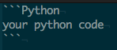

# Technical specifications

This article is about the technical requirements for Hexlet lessons. For non-technical specifications, please refer to [Conceptual specifications for lessons](conceptual-specifications.md).

## Video

* Accepted formats: MOV, QT, OGG, MPEG, AVI.
* Minimum resolution: 1280x720 (720p),
* If it's a screencast, do not record a huge screen, limit to standard 13", 15" or 17".
* Make sure the audio doesn't have much noise. We suggest using an external USB microphone. Logitec USB headsets are usually good enough. We could also recommend "Rode Podcaster", "Blue Microphones", "Snowball" and "Samson C01U".
* Any text, including code that you might show in your IDE, should be large enough to see. Regular font-size for programming is not large enough for video, so make sure you increase the font size.
* Provide all source files: video, sound (if recorded separately), slides (PowerPoint, Keynote or Google Presentations), images.

## Text

* Our editor accepts markdown. Make sure your text is finely formatted. Do not use header 1 for headers, only smaller ones.
* Please, run your texts through a spell checker. For Russian we recommend [Yandex's spell checker](https://tech.yandex.ru/speller/). For English, check out [Grammarly](https://www.grammarly.com/).
* If you want to include images, upload them to imgur.com.
* If you want to include code, wrap it between triple backticks and specify the language like so:

## Challenge specifications

* It should normally take no more than 2 hours to complete the challenge.
* If there are many steps in a single challenge exercise, think about splitting it into multiple exercises or even multiple lessons altogether.
